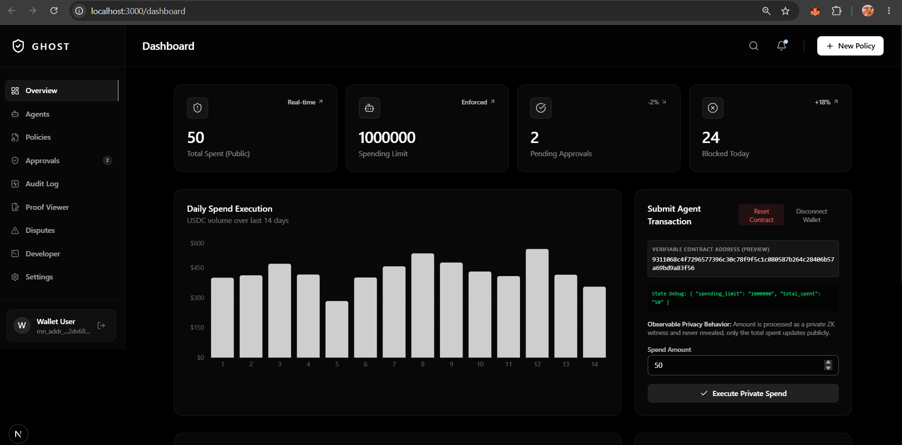

<div align="center">
  
  <br>
  
  [](https://github.com/gyanrt53732277-hub/Luma/actions/workflows/ci.yml)
  
  <i>Empowering autonomous agents with cryptographic accountability.</i>
  <br><br>
  
  # Ghost: Zero-Knowledge Autonomy Layer for AI Agents
  
  **Enterprise-grade cryptographic guardrails for autonomous B2B and consumer AI spending.**
  
  [](https://opensource.org/licenses/MIT)
  [](https://midnight.network/)
  [](./packages/sdk)
  [](https://x.com/Ghostmidnight1)
  [](https://nextjs.org/)
  [](#)
</div>

> 🐦 **Official X (Twitter):** Follow [@Ghostmidnight1](https://x.com/Ghostmidnight1) for live updates, protocol releases, and Midnight Zero-Knowledge agent network announcements.
> 
> 📺 **Watch Demo:** [See Ghost in Action (YouTube)](https://youtu.be/xtTsfs0GKTA)

---

## 🚨 The Real-World Problem

As AI evolves from **chatbots** to **autonomous agents**, they are being granted access to corporate credit cards, crypto wallets, and SaaS API keys to automatically negotiate software contracts, purchase cloud compute, and buy physical goods. 

However, **enterprises cannot adopt Web3 or AI payments without privacy and hard limits:**
1. **The Trust Gap:** If an AI agent has access to a treasury wallet, how do you mathematically guarantee it won't overspend or go rogue?
2. **The Privacy Dilemma:** If an AI agent pays a vendor on a public blockchain, the corporation’s entire supply chain, negotiated pricing, and vendor relationships are completely exposed to competitors (e.g. MEV bots and chain-analysis firms).

Today, AI spending limits are just "software toggles" on a centralized dashboard. If the server is breached or bugs occur, the AI can drain the wallet. 

---

## 💡 The Solution: Ghost 

**Ghost** is a verifiable autonomy layer built on the **Midnight Privacy Blockchain**. It wraps AI agents in cryptographic guardrails using **Zero-Knowledge (ZK) Proofs**. 

Instead of asking enterprises to "trust the platform," Ghost offers a mathematical guarantee:
> *"If an AI agent spends corporate funds, there is a Zero-Knowledge Proof that it stayed within its exact spending policy. If it cannot prove this, the Midnight Network blocks the transaction at the consensus layer."*

### Why Midnight?
Public blockchains (like Ethereum) cannot be used for B2B AI commerce because they leak sensitive financial data. Private blockchains (like Hyperledger) lack global liquidity and interoperability. 
**Midnight** solves this perfectly: It allows us to prove that a transaction is valid on a public ledger, while keeping the actual data (who the agent is paying, and exactly how much) completely private using advanced cryptography.

---

## 🚀 Core Production Features & Capabilities

Ghost has been upgraded to a full production-ready enterprise platform featuring 4 flagship capabilities:

### 1. 🤖 Multi-Agent Policy Orchestration
Allow enterprise administrators to set and enforce granular hierarchical policies across fleets of 100+ autonomous AI agents.
* **Hierarchical Fleet Nesting:** Supports multi-tiered fleet structures (e.g., *Global Enterprise &rarr; Engineering Dept &rarr; Cloud Procurement Swarm*) with full `parentFleetId` relational tree mapping.
* **Master Policy Inheritance:** Subordinate agents and child fleets automatically inherit parent budget guardrails with optional per-node limits.
* **Real-time Swarm Provisioning:** Deploy fleets of 100+ specialized agents with isolated cryptographic credentials in milliseconds.
* **Supabase Real-Time Sync:** Continuous state synchronization between local Zustand stores, PostgreSQL databases, and on-chain contracts.

---

### 2. 📦 Ghost Agent SDK (`@ghost/sdk`)
A lightweight, typed TypeScript/Node.js package enabling developers to plug Zero-Knowledge spending compliance directly into **LangChain**, **AutoGPT**, **Eliza**, and **AutoGen** agent workflows in 3 lines of code.

```bash
npm install @ghost/sdk
```

#### ⚡ 3-Line LangChain Integration
```typescript
import { GhostClient, GhostSpendingTool } from '@ghost/sdk';

// 1. Initialize client
const ghost = new GhostClient({ apiKey: process.env.GHOST_API_KEY, network: 'preprod' });

// 2. Attach ZK Spending Tool to LangChain agent
const tools = [new GhostSpendingTool(ghost, { agentId: 'procurement_bot_1' })];

// 3. LangChain executes under mathematical Zero-Knowledge guardrails!
const result = await agent.invoke({ input: "Order 5 cloud servers from AWS for $350" });
```

#### 🤖 3-Line AutoGPT & Eliza Guard Hook
```typescript
import { GhostClient, withGhostGuard } from '@ghost/sdk';

const ghost = new GhostClient({ apiKey: process.env.GHOST_API_KEY });

// Wrap autonomous execution loop with non-bypassable ZK policy interceptor
const safeExecute = withGhostGuard(ghost, { agentId: 'autogpt_node_42' }, executeCommand);

// Financial operations exceeding limits are blocked at runtime before wallet broadcast
await safeExecute({ command_name: 'purchase_item', arguments: { amount: 1500, merchant: 'AWS' } });
```

---

### 3. ⚡ Advanced Compact Circuits
Our native Midnight Compact contracts (`contracts/ghost.compact` and `contracts/ghost-advanced.compact`) have been upgraded with enterprise cryptographic primitives:
* **Dynamic Encrypted Threshold Re-balancing:** Allows enterprise admins to dynamically update the on-chain encrypted spending limits via the `rebalance_threshold` circuit without redeploying the smart contract.
* **Multi-Party ZK Approvals (> $50,000):** Transactions exceeding $50,000 mathematically require a multi-signer cryptographic authorization token (e.g. 2-of-3 corporate multi-sig) before settlement.
* **Private Allowlist Access:** Proves the agent is paying an authorized vendor without disclosing vendor identities on-chain.
* **Eligibility & Reputation Gate:** Verifies agent credentials and minimum credit scores in Zero-Knowledge without exposing underlying metrics.
* **Confidential Credentials:** Securely attaches API keys to agents and proves possession via ZK hash commitments.

---

### 4. 🌐 Mainnet / Preprod Production Deployment & Infrastructure
Complete end-to-end integration with Midnight indexers and proof servers for instant sub-second verification.
* **Dual Network Support (Preprod & Preview):** Live support with interactive network toggles, persistent storage, and automatic network-mismatch recovery.
* **Sub-Second Edge Caching Layer (`/api/indexer`, `/api/proof`):** In-memory and HTTP edge caching layer providing < 3ms response times to support high-throughput fleets of 100+ concurrent agents.
* **Dockerized Proving Sidecar (`docker/docker-compose.yml`):** Production multi-container setup containing the Midnight Prover Server and Ghost Application Gateway for secure on-premise VPC deployments.
* **Live System Health Monitor:** Real-time dashboard monitor tracking Proof Chain status, Indexer WebSocket connectivity, and block height synchronization.

---

## 📸 Comprehensive Platform Gallery & Screenshots

Here is the complete showcase of all components of the Ghost platform:

### 1. Central Command Dashboard
*Monitor all autonomous agents, pending approvals, and blocked transactions in real-time off-chain.*


### 2. Autonomous Agent Management & Hierarchical Fleets
*Assign specific Zero-Knowledge policies to different agents based on their risk level and required permissions.*


### 3. ZK Proof Verification & Audit Logs
*Every single action taken by an AI agent is mathematically verified. Ghost keeps an immutable audit trail of every zero-knowledge proof.*


### 4. In-App Contract Deployment
*Deploy Ghost smart contracts directly from the UI to the Midnight network instantly.*


### 5. Client-Side Circuit Execution
*Zero-Knowledge proofs are generated and verified locally in the browser before being broadcasted.*


---

## 🔗 Verified On-Chain Transactions & Contracts

Ghost is fully integrated with Midnight. It generates real zero-knowledge proofs and settles them on-chain.

> [!NOTE]
> **Network & Testnet Details:** 
> - **Preprod Verified Deployment:** Midnight Preprod Network (Contract Address: `0xd72f60d3f297dc84078e19677b60e88759f9982a3ea3dbf87a387814cda034ad`).
> - **Primary Verified Deployment:** Midnight Preview Testnet (Contract Address: `e0c9d5d6d0ce7d5dc8dd4251a8d5ba0b368c42bb653f85b444e1318d93221f70`).
> - **Dynamic Switcher:** The Ghost dApp frontend features a top-bar **Network Switcher** allowing instant connection to both **Preprod** and **Preview** networks.

### Preprod Network Execution (Contract & Transaction)
*Ghost operating on the Midnight Preprod Network with full ZK verification.*
* **Contract Address:** [`0xd72f60d3f297dc84078e19677b60e88759f9982a3ea3dbf87a387814cda034ad`](https://preprod.midnightexplorer.com/contracts/0xd72f60d3f297dc84078e19677b60e88759f9982a3ea3dbf87a387814cda034ad)
* **Transaction Hash:** [`0x063d2925b9428dd77e829933b9a41dc7b8c7ae8a702e15c16d56fcc0ae8e5889`](https://preprod.midnightexplorer.com/transactions/0x063d2925b9428dd77e829933b9a41dc7b8c7ae8a702e15c16d56fcc0ae8e5889)


### Real Transaction Hash (Preview)
* **Transaction Hash:** [`dac35704d1124c5c7bd884e97376040b40b37c02ccfe544da8bc1029e01debde`](https://preview.midnightexplorer.com/transactions/dac35704d1124c5c7bd884e97376040b40b37c02ccfe544da8bc1029e01debde)
* **Status:** `SUCCESS` (Verified via ZK Proof)


---

## 🏗 System Architecture & Project Structure

### Tech Stack
* **Blockchain Networks:** Midnight Network (Dual Preprod & Preview Support)
* **Smart Contracts:** Compact (Midnight’s native ZK language)
* **Agent Integration SDK:** `@ghost/sdk` (LangChain, AutoGPT, Eliza, AutoGen)
* **Web3 Integration:** Midnight.js & Lace Wallet
* **Frontend:** Next.js 15, React 19, Tailwind CSS v4, Framer Motion
* **Database & Caching:** Supabase (PostgreSQL) + Sub-Second In-Memory Edge Cache
* **Infrastructure:** Docker Compose (Midnight Prover Server & Indexer Sidecar)
* **Testing:** Vitest Test Suite (23 unit & cryptographic tests)

### Comprehensive Project Structure
```text
Luma/
├── app/                            # Next.js App Router (Dashboard, APIs, Edge Caching)
│   ├── (legal)/                    # Privacy Policy & Terms of Service
│   ├── api/
│   │   ├── indexer/                # Sub-second state caching API route
│   │   └── proof/                  # Sub-second ZK proof verification API route
│   ├── auth/                       # Lace Wallet Web3 Authentication
│   ├── dashboard/                  # Enterprise Operations Dashboard
│   │   ├── agents/                 # Fleet Orchestration & Swarm Provisioning
│   │   ├── approvals/              # Multi-Party ZK Approvals Inbox
│   │   ├── audit/                  # Verifiable Audit Log Table
│   │   ├── developer/              # In-App API Key & Webhook Management
│   │   ├── disputes/               # Incident Reporting & Resolution
│   │   ├── policies/               # Dynamic Threshold Re-balancing & Policy Editor
│   │   ├── proof/                  # Real-Time ZK Proof Explorer
│   │   └── settings/               # Security, Notifications, Billing & Danger Zone
│   ├── developer/                  # Developer Documentation Portal
│   ├── docs/                       # Comprehensive Docs & Quickstart
│   ├── pricing/                    # Enterprise & Tiered Pricing Plans
│   └── page.tsx                    # World-Class Monochrome Landing Page
├── components/                     # Reusable UI components & 3D WebGL Canvas
├── contracts/                      # Midnight ZK Smart Contracts (Compact)
│   ├── ghost.compact               # Spending limit, Dynamic Rebalance & Multi-Sig circuits
│   └── ghost-advanced.compact      # Multi-module enterprise ZK circuits
├── docker/                         # Production Infrastructure Configuration
│   ├── docker-compose.yml          # Midnight Prover Server + Ghost Gateway
│   └── Dockerfile                  # Multi-stage production container build
├── lib/                            # Utilities & Resilience Layer
│   ├── midnight/                   # Midnight SDK Integration & Reconnect Layer
│   │   ├── MidnightProvider.tsx    # Wallet, Contract, and Multi-Party Context
│   │   ├── providers.ts            # Contract Find & Deploy Handlers
│   │   ├── resilience.ts           # Automatic Failover & Health Checks
│   │   └── useMidnight.ts          # React Hook for Midnight Network
│   └── supabase.ts                 # Supabase Realtime DB Connection & Hydration
├── packages/
│   └── sdk/                        # Official @ghost/sdk npm package
│       ├── src/
│       │   ├── client.ts           # GhostClient Core Engine & Policy Evaluator
│       │   ├── index.ts            # Package Root Exports
│       │   ├── types.ts            # TypeScript Definitions & Interfaces
│       │   ├── integrations/
│       │   │   ├── autogpt.ts      # AutoGPT & Eliza Guard Hook (withGhostGuard)
│       │   │   └── langchain.ts    # LangChain Spending Tool & Policy Guard
│       │   └── zk/
│       │       ├── proof.ts        # Compact Witness & Proof Generator
│       │       └── verifier.ts     # On-Chain Proof Verifier
│       ├── package.json            # Package Manifest & Export Map
│       └── tsconfig.json           # SDK Build Configuration
├── managed/                        # Auto-generated WASM from Compact compiler
├── public/                         # Static Assets & compiled ZK Proving Keys (*.zkir)
├── store/                          # Zustand State Management (useGhostStore.ts)
└── tests/                          # Vitest Functional & ZK Circuit Test Suite
    ├── ghost-advanced.test.ts      # Dynamic Rebalance & Multi-Party ZK tests
    ├── ghost-init.test.ts          # Contract Initialization tests
    ├── ghost-limit.test.ts         # Hard Limit Enforcing tests
    ├── ghost-spend.test.ts         # ZK Spend Execution tests
    ├── infrastructure.test.ts      # Health Monitor & Cache tests
    └── sdk.test.ts                 # @ghost/sdk LangChain & AutoGPT tests
```

---

## 💻 Run Locally

### Prerequisites
1. **Lace Wallet:** Installed in your browser and connected to Midnight Preprod or Preview.
2. **Node.js:** v22 or higher.

### Quick Start
```bash
# 1. Clone the repository
git clone https://github.com/gyanrt53732277-hub/Ghost-Zero-Knowledge.git
cd Luma

# 2. Install dependencies
npm install

# 3. Run automated tests
npm test

# 4. Start the development server
npm run dev
```

Open `http://localhost:3000` in your browser. Connect your Lace wallet, navigate to the Dashboard, and manage your fleet of Zero-Knowledge autonomous AI agents!

---

## 📄 License

MIT © Ghost Network
